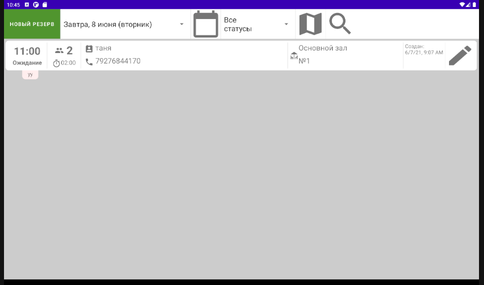
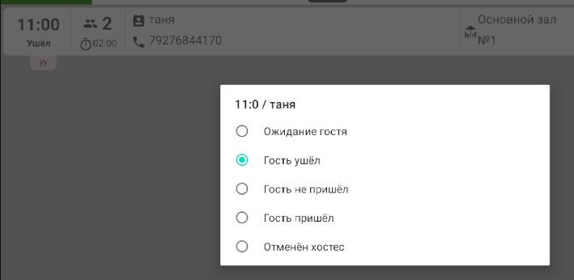
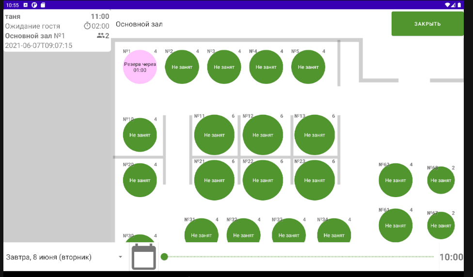
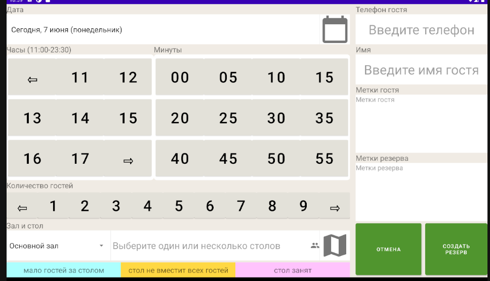

# Описание мобильного приложения Hostes

Приложение предназначено для бронирования мест в ресторане.

## Основное окно приложения

Содержит меню и список резервов (броней) на текущий день

### Пункты меню

- Кнопка "Новый резерв" вызывает окно создания нового резерва
- Выпадающий список дат на ближайшую неделю
- Календарь, позволяет выбрать любую дату
- Выпадающий список статусов резервов, поддерживает множественный выбор, позволяет отфильтровать список резервов
- Кнопка "Схема зала"
- Кнопка "Поиск", позволяет найти резервы по имени гостя или его телефону

### Список резервов

- Время резерва и состояние
- количество гостей и продолжительность резерва
- имя и телефон гостя
- зал и номер(а) столов
- дата и время создания резерва
- кнопка редактирования резерва

При клике по резерву появляется окно смены статуса

## Окно со схемой зала

* В левой части окна отображается список резервов
* В верхнем меню можно выбрать зал
* в нижнем меню можно выбрать дату и время
* В центре отображается схема выбранного зала со столами. Занятые столы выделены цветом. В заголовке стола указан его номер и максимальное количество гостей

## Окно создания (редактрования) резерва

В этом окне можно создать (отредактировать) резерв, указав:     
- дату (из выпадающего списка или из календаря)
- время (учитывается рабочее время ресторана)
- зал
- количество гостей
- стол(ы) (можно выбрать несколько столов в выпадающем списке)
- телефон (после ввода телефона автоматически заполняются имя и метки гостя, если такой уже есть в базе)
- имя гостя
- метки гостя

Столы, дату, время и зал можно выбрать на схеме зала (при этом уже выбранные параметры заменяются)